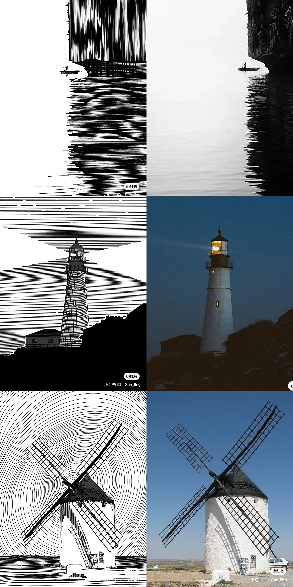

# zgui6644_Week8_Quiz

## Part 1: Imaging Technique Inspiration
**Inspiration Artworks: Drawing with Lines**

*@San_ling

*@Art Easy & @Meredith Terry

*@Claude Monet

I prefer to choose Claude Monet's Saint Georges majeur au crépuscule as the main project. The colorful straight or curved lines and their arrangement in the example can be applied to this project. Although the lines are simple, they are powerful enough to outline the picture vividly. This is an effective way to encode landscape artworks. For example, in Claude Monet’s artwork, straight lines arranged vertically represent the sky, and curved lines arranged horizontally represent the ocean. Clear partitions combined with modular codes can not only display pictures vividly, but also make the coding process clear and logical.

## Part 2: Coding Technique Exploration
“bezier()” is a useful coding technique to draw the lines as waves in the ocean mentioned above. It can form shapes and curves via two anchor points and two control points, so it will be easier to draw sea waves and control them.

**Coding Sample**

The sample was coded by [wangz318](https://editor.p5js.org/wangz318/sketches/HAdppoOeX).